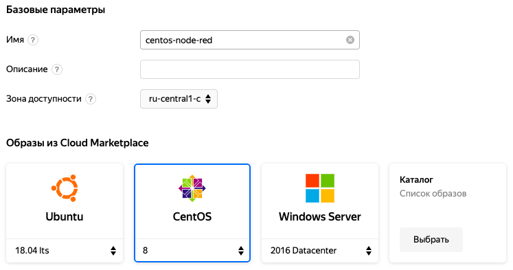
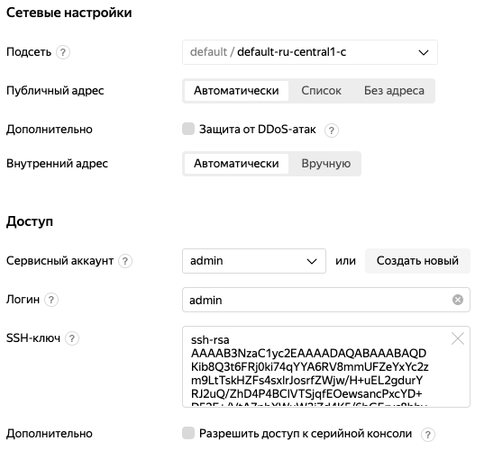
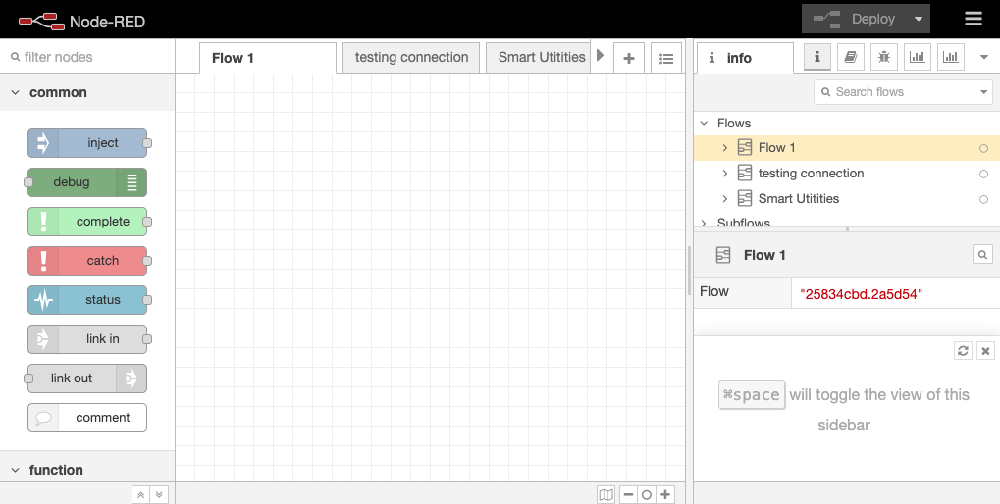
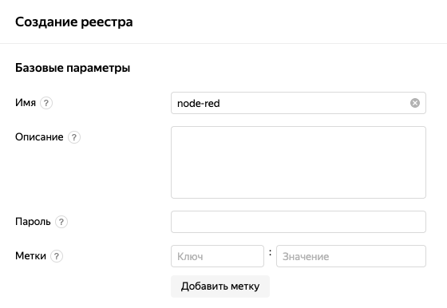
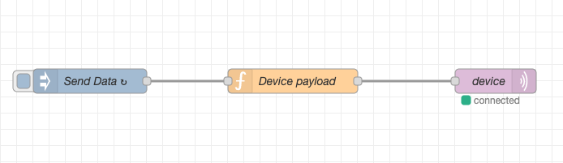
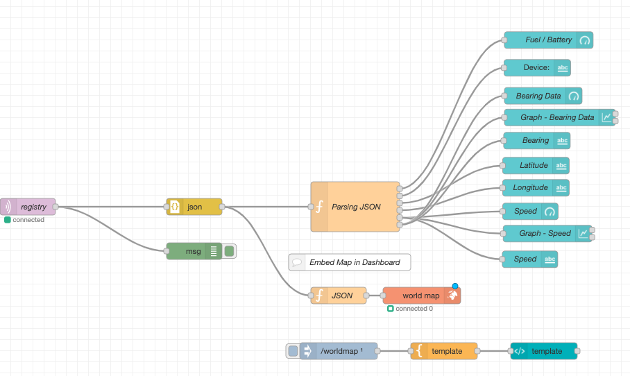
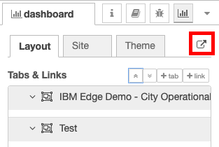
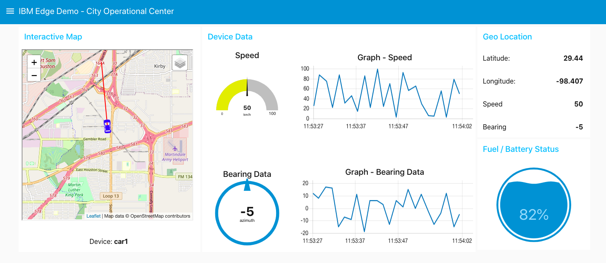

# Знакомство с Node-RED и потоковое программирование в Yandex IoT Core

В этой статье хотелось бы разобрать один из наиболее популярных инструментов с открытым исходным кодом - [Node-RED](https://nodered.org), с точки зрения создания простых прототипов приложений с минимум программирования, проверить гипотезу о простоте и удобстве таких средств, а также рассмотреть его взаимодействие с облачной платформой на примере [Яндекс.Облако](https://cloud.yandex.ru).

После появления ряда ограничений, связанных с хранением данных клиентов в облачных дата-центрах других государств, все чаще у пользователей [IBM Cloud](https://cloud.ibm.com/registration) начали появляться соответствующие вопросы, а также желание использовать какие-то гибридные подходы и облачные сервисы, расположенные на территории России. 

Написано уже немало статей на тему использования средств визуального программирования при создании приложений для Интернета Вещей ([управление освещением](https://habr.com/ru/post/396985/), [автоматизация квартиры часть 1](https://habr.com/ru/company/tinkoff/blog/487984/), [автоматизация квартиры часть 2](https://habr.com/ru/company/tinkoff/blog/489774/)), управления разнообразными устройствами и домашней автоматизации. Однако мало кто упоминает о другом полезном свойстве подобных иструментов - это быстрое прототипирование, то есть эмуляция самих устройств и визуализация результатов их работы без глубоких познаний в программировании или веб-дизайне.

**Кратко о Node-Red, его истории, создателях и сообществе**

Как гласит первоисточник, [Node-RED](https://nodered.org/about/) - это инструмент потокового программирования, первоначально разработанный командой [IBM Emerging Technology Services](https://emerging-technology.co.uk/) и в настоящее время являющийся частью [JS Foundation](https://openjsf.org/).

В качестве ключевой составляющей Node-RED выступает парадигма [потокового программирования](https://en.wikipedia.org/wiki/Flow-based_programming), которое было изобретено в 1970-х годах Дж. Полом Моррисоном (J. Paul Morrison). Потоковое программирование - это способ описания поведения приложения в виде сети чёрных ящиков или «узлов», как они называются в Node-RED. Каждый узел имеет четко определенную цель - к нему поступают некоторые данные, он что-то делает с этими данными, а затем передает эти данные на следующий узел. Сеть отвечает за поток данных между узлами.
Эта модель очень хорошо подходит для визуального представления и делает ее более доступной для широкого круга пользователей. Если кто-то пытается разобраться в проблеме, он может разбить задачу на отдельные шаги, взглянуть на поток и понять, что он делает без необходимости разбираться в отдельных строках кода на каждом узле.

Node-RED работает в среде исполнения Node.js, а для создания или редактирования потока ("Flow") используется веб-браузер. В браузере вы можете создавать свое приложение путем перетаскивания необходимых узлов ("Node") из палитры в рабочую область и соединять их вместе. Одним щелчком мыши на кнопке "Deploy" приложение разворачивается в среде исполнения и запускается.
Палитра узлов может быть легко расширена путем установки новых узлов, созданных сообществом, а созданные вами потоки могут быть легко переданы в виде файлов JavaScript Object Notation (JSON).

Node-RED начал свою жизнь в начале 2013 года как совместный проект Ника О'Лири ([Nick O’Leary](https://github.com/knolleary)) и Дейва Конвея-Джонса ([Dave Conway-Jones](https://github.com/dceejay)) из группы IBM Emerging Technology Services.
Проект начинался как подтверждение концепции визуализации и манипулирования мэппингами между топиками Message Queuing Telemetry Transport (MQTT), быстро стал более универсальным инструментом, который можно было легко расширять в любом направлении.
[Исходный код проекта](https://github.com/node-red/node-red) был открыт в сентябре 2013 года и с тех пор он разрабатывался в открытом виде, кульминацией развития стало признание Node-RED одним из фундаментальных проектов JS Foundation в октябре 2016 года.

**Почему проект называется Node-RED?**

Со слов авторов:
> Название было веселой игрой слов, звучащих как «Code Red».
> Это название приклеелось к проекту и стало существенным улучшением для того, как он назывался в первые несколько дней.
> Часть «Node» отражает суть модели потокового программирования (поток/узел), так и основную среду выполнения Node.JS.
> Окончательного решения о том, что же означает часть «RED», принято так и не было.
> Одним из предложений было «Rapid Event Developer» (быстрый разработчик событий), но мы никогда не чувствовали себя обязанными что-либо формализовать.
> Мы придерживаемся названия «Node-RED»."

Node-RED предоставляется в соответствии с условиями лицензии Apache 2.0. Важно понимать и осознавать условия [этой лицензии](https://github.com/node-red/node-red/blob/master/LICENSE), но в предоставленной ссылке есть краткая выдержка с её основными свойствами: https://tldrlegal.com/license/apache-license-2.0-(apache-2.0).
Лицензия разрешает коммерческое использование, но при этом накладывает и ряд ограничений. Основные ограничения: использование торговой марки (Trademark use) - нельзя искажать торговую марку Node-RED (принадлежащую OpenJS Foundation) и ограничение ответственности (Liability/Warranty), то есть участники проекта не могут быть привлечены к ответственности в случае причинения каких либо вероятных убытков при некорректном использовании продукта их труда.

## Постановка задачи - интеграция Node-RED c Yandex IoT Core

Прежде всего затея самообразовательная, но все таки хотелось исследовать что-то новое, например - возможности предлагаемых облачных сред и сервисов Яндекс, которые могут быть безвозмездно получены на продолжительное время (до 60 дней). Ну а чтобы с пользой делу, было решено посмотреть насколько совместимы «из коробки» на уровне MQTT узлы реализованные в проекте Node-RED и интерфейсы сервиса IoT Core.

Соответственно первоначальная задача выглядела не очень сложно:
- Развернуть и настроить виртуальную машину в облаке
- Установить и запустить на ней Node-Red (хотя в контейнере возможно было бы быстрее)
- Создать и настроить сервис IoT Core
- Эмулировать IoT устройство в Node-Red
- Подключить созданное устройство к облачной платформе
- Отправлять сообщения в облако и пополучать ответы
- Визуализировать результаты в виде прототипа приложения

Чтобы было повеселее, предположим что есть гениальная идея создания уникального приложения для "Подключаемых Автомобилей", которое требует быстрой апробации некоторых концепций и пусть создание прототипа будет первым шагом на этом пути.

## Создание облачной среды и установка Node-RED

### Создание ВМ
Для создания виртуальной машины, на которой далее запустим Node-RED, зайдем в [Яндекс Облако](https://cloud.yandex.ru/) и перейдем в [Консоль](https://console.cloud.yandex.ru/).
В сервисе *Compute Cloud* нажимаем **Создать ВМ**.

Задаем машине любое разрешенное имя и в качестве операционной системы выбираем CentOS. Для запуска Node-RED подходит любая из приведенных ОС, однако в данной статье рассмотрен порядок работы только с CentOS.



Выполнение тестового сценария не требует больших ресурсов, поэтому выставляем все на минимум. Данный ход также позволит сэкономить ресурсы пробного периода, если Вы решили развернуть Node-RED только для ознакомления.


Работа с ВМ будет осуществляться через SSH, поэтому выделим автоматически выделенный публичный адрес машине.
Для подключения к машине по SSH необходимо указать публичный ключ. Сгенерируем SSH-ключи командой `ssh-keygen -t rsa -b 2048` в терминале, потребуется придумать ключевую фразу.
Теперь требуемый ключ хранится в `~/.ssh/is_rsa.pub`, копируем его в поле *SSH-ключ* и жмем **Создать ВМ**.



    

### Подключение к ВМ
После завершения процесса подготовки ВМ в сервисе *Compute Cloud* появится наша машина с заполненным полем *Публичный IPv4*.
Также нам необходим логин, который мы указывали на предыдущем шаге в разделе *Доступ*.
Выполним подключение к машине по SSH командой
`$ ssh <login>@<IPv4>`. При подключении потребуется ввести ключевую фразу, которую мы указали на этапе генерации ключей.

```
$ ssh <login>@<IPv4>
Enter passphrase for key '/Users/<user>/.ssh/id_rsa': 

Last login: Wed Jul 15 08:42:53 2020 from <your host ip>
[<login>@node-red ~]$ 
```

### Установка Node-RED
Наконец, мы можем установить Node-RED. Самый удобный способ для новой, пустой системы - это [Linux installers for Node-RED](https://github.com/node-red/linux-installers)
из репозитория данного проекта. Так как мы используем *CentOS 8*, нам необходима вторая команда для ОС, основанных на RPM:
```
$ bash <(curl -sL https://raw.githubusercontent.com/node-red/linux-installers/master/rpm/update-nodejs-and-nodered)

...
  Stop Node-RED                       ✔
  Install Node.js LTS                 ✔   Node v10.19.0   Npm 6.13.4
  Install Node-RED core               ✔   1.1.2 
  Add shortcut commands               ✔
  Update systemd script               ✔
  Update public zone firewall rule    ✔
                                      

Any errors will be logged to   /var/log/nodered-install.log
All done.
  You can now start Node-RED with the command  node-red-start
  Then point your browser to localhost:1880 or http://{your_pi_ip-address}:1880
...
```

Скрипт установит LTS версию Node.js, базовую версию Node-RED, создаст скрипт автозапуска для systemd и по желанию создаст правила для порта 1880 в firewall. Для проверки успешности установки можно запустить:

```
$ node-red-start
```

**Примечание:** для выхода из Node-RED нажмите Ctrl+C

Для активации автозапуска и старта службы с помощью systemctl выполните:

```
$ sudo systemctl enable --now nodered.service
```

После этого по адресу `http://{ip вашей машины}:1880` в браузере будет доступен для работы Node-RED.



## Подготовка сервиса Yandex IoT Core и его настройка
Возвращаемся в [Консоль](https://console.cloud.yandex.ru/), выбираем *IoT Core* и нажимаем **Создать реестр**. Указываем любое подходящее имя и далее определимся со способом авторизации.
IoT Core поддерживает два способа: с помощью сертификатов и по логину-паролю. Для нашего тестового сценария намного быстрее использовать последний, поэтому заполним поле *Пароль*, длина пароля минимум 14 символов.



После создания переходим в реестр во вкладку *Устройства* слева и нажимаем **Добавить устройство**.
Аналогично реестру задаем имя и пароль. 

Теперь в пункте *Обзор* реестра видим *ID* реестра и помним пароль, которые писали при создании реестра. Тоже самое с устройством: на странице устройства указан его *ID*.


## Пример создания простого приложения в Node-Red
Перейдем в `http://{ip вашей машины}:1880`. Импортируем готовый пример, где нам потребуется лишь указать наши данные реестра и устройства.
В меню в правом верхнем углу Node-RED нажмем *Import*. Flow в формате *.json* берем [отсюда](https://github.ibm.com/vitaly-bondarenko/node-red-iot-core/blob/master/sample_device.json) и либо копируем содержимое в поле, либо скачиваем файл и жмем *select a file to import*.
В новой вкладке появляется flow *testing connection*. 
Рассмотрим добавленные узла. *Send data* - узел типа *Inject*, предназначен для ручного или автоматического запуска flow.
*Device payload* - узел функция, позволяет выполнять JavaScript для обработки данных, проходящих через него.
*device* - *mqtt-out* узел с настраиваемым mqtt-подключением, предназначен для публикации данных в топик.


Два раза кликаем по узлу *device*. 
Нам необходимо заменить *<id_реестра>* на ID нашего реестра в IoT Core. Далее редактируем данные в *Server*. Во вкладке *Security* указываем username - это ID созданного нами устройства, а password - пароль, придуманный на этапе создания устройства. После чего сначала жмем *Update*, а далее *Done*.
Протестируем соединение: в правом верхнем углу нажмем *Deploy*. Под узлом *device* появится подпись *connected*.

Импортируем [flow с dashboard](https://github.ibm.com/vitaly-bondarenko/node-red-iot-core/blob/master/sample_dashboard.json)
таким же образом. После импорта будет показано сообщение о недостающих компонентах, загрузим их. В меню в правом верхнем углу перейдем в *Manage palette*. В появившемся окне во вкладке *Install* в поисковом поле пропишем `node-red-dashboard` и в найденных пакетах установим самый первый. Таким же образом установим `node-red-contrib-web-worldmap`.

Данный flow получился намного интереснее предыдущего, можем заметить новые узлы.
Так, *registry* - *mqtt-in* узел, принимает сообщения из указанного в настройках топика и передает их следующим узлам.
Измеряемые данные приходят в строке, поэтому применяется узел разбора сообщений *json*, может конвертировать JSON-объект в его JS-представление и обратно.
*Parsing JSON* и *JSON* возвращают полученные измерения уже в виде отдельных объектов, которые далее передаются узлам, отвечающим за элементы *Dashboard*.



Теперь необходимо настроить узел *registry*. Аналогично первому flow записываем наш ID реестра и переходим в настройки сервера *iot-core-subscription*. 
Во вкладке *Security* добавляем данные **реестра**, сохраняем изменения и жмем *Deploy*.

Если все поля заполнены верно, то после развертывания под узлом registry тоже появится подпись *connected*. 
В окне справа последння вкладка с иконкой столбчатой диаграммы отвечает за *Dashboard*. Перейти в Dashboard можно по кнопке, выделенной на скриншоте.



Каждые 3 секунды устройство из flow *testing connection* генерирует данные, отправялет их в топик нашего реестра, а flow *Smart Utilities* в свою очередь подписывается на этот топик и обновляет *Dashboard* в соответствии с приходящими с IoT Core данными.



## В качестве результатов и краткого заключения

Конечно нет в мире ничего бесплатного, а то иначе закон сохранения энергии перестанет работать)
Тем не менее, при первичной регистрации с некоторыми усилиями в Яндекс Облаке (в обмен на реквизиты вашей платежной-карты, правда не всякой - виртуальные у меня не завелись) на пробный период можно получить вполне достойную квоту облачных ресурсов в виде виртуальных машин или в терминах платформы "Compute Cloud" (на сумму аж в 1000руб.) и все остальные сервисы (с квотой до 3000руб.). Если пользоваться аккуратно, то на 60 дней хватает более чем.

Node-RED действительно скачать может любой желающий и совсем безвозместно. При первом знакомстве он вызывает некоторые вопросы в плане логики работы и прививает какую-то свою непередаваемую любовь к узлу "debug" и вкладке "debug messages", но после того как осмотришься и поймешь как все устроено, то все встает на свои места и действительно становится очень просто. Совсем без познаний в программировании обойтись не получится, требуется хоть какое-то представление о том, что такое: переменные, условия, циклы, массивы, JSON сообщения и как осуществлять их разбор. Тем не менее, узлы из раздела "Network", такие как "mqtt in/out" заработали с сервисом Яндекса IoT Core вообще без проблем при условии их правильной конфигурации.

Умышленно не стал очень детально описывать как создается само приложение, поскольку есть исходник потока в JSON и сама идея проекта Node-RED предполагает что любой желающий может: "...взглянуть на поток и понять, что он делает без необходимости разбираться в отдельных строках кода на каждом узле", но в код лучше заглянуть ;)

## Ссылки на полезные материалы

- Node-Red на GitHub: https://github.com/node-red/
- Документация проекта Node-RED (ENG): https://nodered.org/docs/
- Книга рецептов (ENG): https://cookbook.nodered.org/
- Как начать с Node-Red (ENG), включая другие облачные среды: https://nodered.org/docs/getting-started/
- Node-RED гостит у папы (ENG): https://developer.ibm.com/components/node-red/
- Рецепты по Node-RED в IBM (ENG): https://developer.ibm.com/recipes/tag/node-red/
- Видео от создателей (ENG+RUS-Subs): https://youtu.be/vYreeoCoQPI

Отдельное спасибо за помощь при создании статьи: <...>

## <НЕ ДЛЯ ПУБЛИКАЦИИ> На перспективу (Roadmap) по приоритетам
1) Интеграция прототипа с PostgreSQL и сервисом визуализации на базе DataLens.
Хорошо бы вовлечь энтузиастов, кто готов помочь или хотя бы пару раз созвониться чтобы подсказали.
2) Сценарий для Яндекс Cloud Functions (ServerLess) или написать узел Node-RED (ожидается поддержка Knative).
В случае написания нового узла необходим "спонсор", поскольку задача может быть трудоемкой.
3) Рассмотреть возможность использования Open Source проекта Open-Horizon для Edge в Я.Облаке.
4) Подумать над прототипом native-гибридного облачного сервиса (Я.Облако<->IBM-Watson).
5) Адаптировать коннектор NodeRED для Яндекс IoT Core (MQTT) чтобы было меньше полей.

