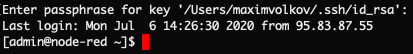

# node-red-iot-core

## Node-RED для Yandex IoT Core (рабочее название)


План статьи на базе так называемой техники STAR - начиная с описания ситуации и задачи (ST = Situation/Task), потом с действий, которые вы сделали (A = Actions) и заканчивая результатами (R = Results):


### 1) Визуальное программирование для Интеренета Вещей и событийных приложений с малым количеством кода (Node-RED)

Написано уже немало статей на тему использования средств визуального программирования при создании приложений для Интеренета Вещей [один]https://habr.com/ru/post/396985/, [два] https://habr.com/ru/company/tinkoff/blog/487984/, [три]https://habr.com/ru/company/tinkoff/blog/489774/ , управления разнообразными устройствами и домашней автоматизации. Однако мало кто упоминает о другом полезном свойстве подобных иструментов - это быстрое прототипирование, то есть эмуляция самих устройств и визуализация результатов их работы без грубоких познаний в программировании или веб-дизайне.

В этой статье хотелось бы разобрать один из наиболее популярных инструментов с открытым исходным кодом - Node-RED с точки зрения создания простых прототипов приложений с минимум программирования, проверить гипотезу о простоте и удобстве таких средств, а также рассмотреть его взаимодействие с облачной платформой в отрыве от его родной IBM Cloud.


### 2) Кратко о Node-Red, его истории, создателях (Nicholas O'Leary/UK/IBM) и сообществе

Node-RED is a flow-based programming tool, originally developed by IBM’s Emerging Technology Services team and now a part of the JS Foundation.

Node-RED is made available under the terms of the Apache 2 license. It's important to understand the terms of that license, but this provides a good summary - https://tldrlegal.com/license/apache-license-2.0-(apache-2.0) The license allows for commercial usage. The main restrictions are: they cannot misrepresent the Node-RED trademark (which belongs to the OpenJS Foundation) and they cannot hold the project liable for anything they chose to do with it.

### <Вит> 3) Постановка задачи - интеграция Node-RED c Yandex IoT Core для создания прототипа приложения "Умное ЖКХ" или "Самоуправляемые Автомобили" лизнуть Яндексу (вставить любое)

### <Макс> 4) Создание ВМ на CentOS и установка Node-RED и автоматический запуск сервиса (автозагрузка) через systemctl

#### Создание ВМ
Для создания виртуальной машины, на которой далее запустим Node-RED, зайдем в [Яндекс Облако](https://cloud.yandex.ru/) и перейдем в [Консоль](https://console.cloud.yandex.ru/).
В сервисе *Compute Cloud* нажимаем **Создать ВМ**.

Задаем машине любое разрешенное имя и в качестве операционной системы выбираем CentOS. Для запуска Node-RED подходит любая из приведенных ОС, однако в данной статье рассмотрен порядок работы только с CentOS.


Выполнение тестового сценария не требует больших ресурсов, поэтому выставляем все на минимум. Данный ход также позволит сэкономить ресурсы пробного периода, если Вы решили развернуть Node-RED только для ознакомления.


Работа с ВМ будет осуществляться через SSH, поэтому выделим автоматически выделенный публичный адрес машине.
Для подключения к машине по SSH необходимо указать публичный ключ. Сгенерируем SSH-ключи командой `ssh-keygen -t rsa -b 2048` в терминале, потребуется придумать ключевую фразу.
Теперь требуемый ключ хранится в `~/.ssh/is_rsa.pub`, копируем его в поле *SSH-ключ* и жмем **Создать ВМ**.


    

#### Подключение к ВМ
После завершения процесса подготовки ВМ в сервисе *Compute Cloud* появится наша машина с заполненным полем *Публичный IPv4*.
Также нам необходим логин, который мы указывали на предыдущем шаге в разделе *Доступ*.
Выполним подключение к машине по SSH командой
`$ ssh <login>@<IPv4>`. При подключении потребуется ввести ключевую фразу, которую мы указали на этапе генерации ключей.



#### Установка Node-RED
Наконец, мы можем установить Node-RED. Самый удобный способ для новой, пустой системы - это [Linux installers for Node-RED](https://github.com/node-red/linux-installers)
из репозитория данного проекта. Так как мы используем *CentOS 8*, нам необходима вторая команда для ОС, основанных на RPM:
```
$ bash <(curl -sL https://raw.githubusercontent.com/node-red/linux-installers/master/rpm/update-nodejs-and-nodered)

...
  Stop Node-RED                       ✔
  Install Node.js LTS                 ✔   Node v10.19.0   Npm 6.13.4
  Install Node-RED core               ✔   1.1.2 
  Add shortcut commands               ✔
  Update systemd script               ✔
  Update public zone firewall rule    ✔
                                      

Any errors will be logged to   /var/log/nodered-install.log
All done.
  You can now start Node-RED with the command  node-red-start
  Then point your browser to localhost:1880 or http://{your_pi_ip-address}:1880
...
```

Скрипт установит LTS версию Node.js, базовую версию Node-RED, создаст скрипт автозапуска для systemd и по желанию создаст правила для порта 1880 в firewall. Для проверки успешности установки можно запустить:

```
$ node-red-start
```

**Примечание:** для выхода из Node-RED нажмите Ctrl+C

Для ативации автозапуска и старта службы с помощью systemctl выполните:

```
$ sudo systemctl enable --now nodered.service
```

После этого по адресу `http://{ip вашей машины}:1880` в браузере будет доступен для работы Node-RED.


*... здесь будет про systemctl или другой способ (команда сверху не работает с sudo)*


### <Макс> 5) Детальная настройка Yandex IoT Core: создание реестра, устройста и id/логины/пароли
Возвращаемся в [Консоль](https://console.cloud.yandex.ru/), выбираем *IoT Core* и нажимаем **Создать реестр**. Указываем любое подходящее имя и далее определимся со способом авторизации.
IoT Core поддерживает два способа: с помощью сертификатов и по логину-паролю. Для нашего тестового сценария намного быстрее использовать последний, поэтому заполним поле *Пароль*, длина пароля минимум 14 символов.


После создания переходим в реестр во вкладку *Устройства* слева и нажимаем **Добавить устройство**.
Аналогично реестру задаем имя и пароль. 

Теперь в пункте *Обзор* реестра видим *ID* реестра и помним пароль, которые писали при создании реестра. Тоже самое с устройством: на странице устройства указан его *ID*.
### <Макс> 6) Создание приложения в Node-Red (MQTT-nodes-out-in, function, dashboard)
Перейдем в `http://{ip вашей машины}:1880`. Импортируем готовый пример, где нам потребуется лишь указать наши данные реестра и устройства.
В меню в правом верхнем углу Node-RED нажмем *Import*. Flow в формате *.json* берем [отсюда](https://github.ibm.com/vitaly-bondarenko/node-red-iot-core/blob/master/sample_device.json) и либо копируем содержимое в поле, либо скачиваем файл и жмем *select a file to import*.
В новой вкладке появляется flow *testing connection*, в нем два раза кликаем по ноду *device*. 
Нам необходимо заменить *<id_реестра>* на ID нашего реестра в IoT Core. Далее редактируем данные в *Server*. Во вкладке *Security* указываем username - это ID созданного нами устройства, а password - пароль, придуманный на этапе создания устройства. После чего сначала жмем *Update*, а далее *Done*.
Протестируем соединение: в правом верхнем углу нажмем *Deploy*. Под нодом *device* появится подпись *connected*.

Импортируем [flow с dashboard](https://github.ibm.com/vitaly-bondarenko/node-red-iot-core/blob/master/sample_dashboard.json)
таким же образом. После импорта будет показано сообщение о недостающих компонентах, загрузим их. В меню в правом верхнем углу перейдем в *Manage palette*. В появившемся окне во вкладке *Install* в поисковом поле пропишем `node-red-dashboard` и в найденных пакетах установим самый первый. Таким же образом установим `node-red-contrib-web-worldmap`.
Теперь необходимо настроить нод *registry*. Аналогично первому flow записываем наш ID реестра и переходим в настройки сервера *iot-core-subscription*. 
Во вкладке *Security* добавляем данные **реестра**, сохраняем изменения и жмем *Deploy*.

Если все поля заполнены верно, то после развертывания под нодом registry тоже появится подпись *connected*. 
В окне справа последння вкладка с иконкой столбчатой диаграммы отвечает за *Dashboard*. Перейти в Dashboard можно по кнопке, выделенной на скриншоте.


Каждые 3 секунды устройство из flow *testing connection* генерирует данные, отправялет их в топик нашего реестра, а flow *Smart Utilities* в свою очередь подписывается на этот топик и обновляет *Dashboard* в соответствии с приходящими с IoT Core данными.


### <Вит> 7) Краткое заключение / набор полезных материалов (ссылки)


На перспективу (Roadmap)
- Адаптировать коннектор NodeRED для Яндекс IoT Core (MQTT) чтобы было меньше полей
- Написать коннектор NodeRED для Яндекс ServerLess
